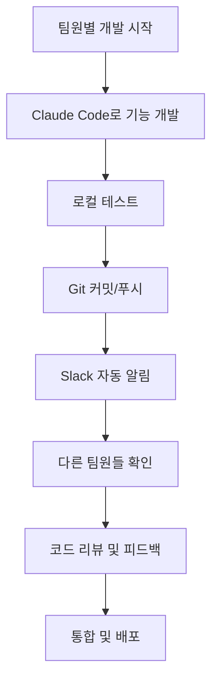

# 🌟 아마존 크롤링 프로젝트 팀 공유 완전 가이드

## 📋 프로젝트 공유 개요

완성된 **아마존-네이버 스마트스토어 자동화 프로젝트**를 팀원들과 공유하여 각자의 Claude Code에서 협업하는 완전 가이드입니다.

## 🎯 1단계: GitHub 저장소 생성 및 업로드

### A. GitHub 계정 및 저장소 생성

1. **GitHub 계정 생성/로그인**
   - [github.com](https://github.com) 접속
   - 계정이 없다면 회원가입 진행

2. **새 저장소 생성**
   - 우상단 **"+"** 버튼 → **"New repository"** 클릭
   - **저장소 설정**:
     ```
     Repository name: amazon-smartstore-automation
     Description: 아마존-네이버 스마트스토어 자동화 프로젝트 (완성된 38개 상품 크롤링 시스템)
     Visibility: Private (팀 프로젝트이므로 비공개 권장)
     Initialize: ❌ README, .gitignore, license 체크 해제 (이미 생성됨)
     ```

3. **저장소 URL 복사**
   - 생성 완료 후 나타나는 URL 복사 (예: `https://github.com/your-username/amazon-smartstore-automation.git`)

### B. 로컬 프로젝트를 GitHub에 업로드

```bash
# 현재 프로젝트 디렉토리에서 실행
cd "C:\Users\PC8\Desktop\claude\아마존 크롤링"

# 원격 저장소 연결
git remote add origin https://github.com/YOUR_USERNAME/amazon-smartstore-automation.git

# 기본 브랜치를 main으로 변경 (GitHub 표준)
git branch -M main

# GitHub에 업로드
git push -u origin main
```

**⚠️ 주의: YOUR_USERNAME을 실제 GitHub 사용자명으로 변경**

## 🔑 2단계: 필요한 정보 준비

### A. 팀원들에게 제공해야 할 정보

#### 📧 **필수 공유 정보**
```
📊 프로젝트: 아마존-네이버 스마트스토어 자동화
🔗 GitHub 저장소: https://github.com/YOUR_USERNAME/amazon-smartstore-automation
📋 현재 상태: 38개 상품 크롤링 완료, 100% 실행 가능
🎯 협업 목표: 기능 확장/개선 (UI, 성능, API 연동 등)

🔧 기술 스택:
- Python 3.8+
- Selenium (웹 크롤링)
- Pandas (데이터 처리)  
- tkinter (GUI)
- 네이버 API 연동

📱 협업 도구:
- Git/GitHub (코드 공유)
- Slack (실시간 알림)
- Claude Code (AI 개발)
```

#### 🎫 **팀원별 GitHub 접근 권한**
각 팀원의 GitHub 사용자명을 수집하여 저장소에 초대

#### 🔐 **개인별 준비사항**
각 팀원이 개별적으로 준비해야 할 것들:
- GitHub Personal Access Token
- 개인 Git 설정 정보
- Slack 계정 (팀 워크스페이스 참여)

### B. Slack 워크스페이스 정보

#### 📱 **Slack 워크스페이스 생성**
1. **워크스페이스 생성**
   - [slack.com](https://slack.com) → "새 워크스페이스 만들기"
   - 이름: `Amazon Smartstore Team` (또는 원하는 이름)

2. **웹훅 URL 생성**
   - [api.slack.com/apps](https://api.slack.com/apps) 에서 앱 생성
   - Incoming Webhooks 활성화
   - 생성된 URL: `https://hooks.slack.com/services/T.../B.../...`

3. **팀원 초대 링크 생성**
   - Slack 워크스페이스에서 초대 링크 생성
   - 만료 기간 설정 (7일 권장)

## 🚀 3단계: 팀원 초대 프로세스

### A. GitHub 저장소 팀원 초대

1. **GitHub 저장소 페이지 접속**
   - `https://github.com/YOUR_USERNAME/amazon-smartstore-automation`

2. **Settings → Manage access**
   - **"Invite a collaborator"** 클릭
   - 팀원들의 GitHub 사용자명 또는 이메일 입력
   - 권한 설정: **Write** (코드 수정 권한) 또는 **Admin** (관리자 권한)

3. **초대 확인**
   - 각 팀원이 이메일 초대를 승인해야 함

### B. 팀원용 설정 패키지 준비

각 팀원에게 전달할 파일들:
```
📦 팀원 설정 패키지:
├── TEAM_COLLABORATION_GUIDE.md  (완전한 설정 가이드)
├── SLACK_SETUP_GUIDE.md         (Slack 설정 방법)
├── .env.template                 (환경변수 템플릿)
├── requirements_collaboration.txt (필요 패키지 목록)
└── 팀원별_개인정보.txt            (개인별 맞춤 정보)
```

**팀원별 개인정보 템플릿:**
```
=== [팀원명] 개인 설정 정보 ===

GitHub 저장소: https://github.com/YOUR_USERNAME/amazon-smartstore-automation
당신의 역할: Frontend 개발 / Backend 최적화 / API 연동 / QA 테스트

필요한 개인 토큰:
- GitHub Personal Access Token: [직접 생성 필요]
- Git 사용자 설정:
  * user.name: "당신의 이름"  
  * user.email: "당신의 이메일"

Slack 정보:
- 워크스페이스 초대 링크: [7일간 유효]
- 웹훅 URL: https://hooks.slack.com/services/T.../B.../...
- 주요 채널: #amazon-project, #dev-logs

협업 도구 테스트:
python git_slack_collaboration.py
```

## 🔧 4단계: 팀원별 환경 설정 지원

### A. 원격 지원 체크리스트

각 팀원이 완료해야 할 단계들:

#### ✅ **1단계: 기본 환경 준비**
- [ ] Python 3.8+ 설치 확인: `python --version`
- [ ] Git 설치 확인: `git --version`  
- [ ] GitHub 계정 생성/로그인
- [ ] 저장소 접근 권한 승인

#### ✅ **2단계: 프로젝트 클론**
```bash
# 저장소 클론
git clone https://github.com/YOUR_USERNAME/amazon-smartstore-automation.git

# 디렉토리 이동
cd amazon-smartstore-automation

# 파일 확인
ls -la  # Mac/Linux
dir     # Windows
```

#### ✅ **3단계: 환경 설정**
```bash
# 가상환경 생성
python -m venv venv

# 가상환경 활성화
# Windows:
venv\Scripts\activate
# Mac/Linux:
source venv/bin/activate

# 패키지 설치
pip install -r requirements_collaboration.txt

# .env 파일 생성
copy .env.template .env      # Windows
cp .env.template .env        # Mac/Linux
```

#### ✅ **4단계: 개인 설정**
`.env` 파일 편집:
```bash
GITHUB_TOKEN=개인_토큰_여기에_입력
GITHUB_USERNAME=본인_GitHub_사용자명
GITHUB_EMAIL=본인_이메일@example.com
SLACK_WEBHOOK_URL=팀_슬랙_웹훅_URL
```

#### ✅ **5단계: 연결 테스트**
```bash
# 협업 도구 테스트
python git_slack_collaboration.py

# 메뉴에서 "1. 팀 상태 리포트 전송" 선택
# Slack에 메시지가 오면 성공!
```

### B. 문제 해결 지원

#### 🚨 **자주 발생하는 문제들**

**1. Git 인증 오류**
```bash
# 해결방법
git config --global credential.helper store
# 다음 git 명령어에서 토큰을 username으로 입력
```

**2. 패키지 설치 오류**
```bash
# 해결방법
pip install --upgrade pip
pip cache purge
pip install -r requirements_collaboration.txt --force-reinstall
```

**3. Slack 연동 안됨**
- 웹훅 URL이 정확한지 확인
- 워크스페이스 권한 확인
- 채널 이름이 정확한지 확인 (#amazon-project)

**4. 프로젝트 실행 오류**
```bash
# 메인 프로그램 테스트
python amazon_smartstore_integrated.py

# 오류 발생 시 의존성 재확인
pip install selenium pandas openpyxl beautifulsoup4 requests
```

## 📱 5단계: 실시간 협업 시작

### A. 첫 협업 테스트

**팀원 A (예시):**
```bash
# 1. 최신 코드 동기화
python -c "
from git_slack_collaboration import GitSlackCollaboration
collab = GitSlackCollaboration()
collab.sync_with_remote()
"

# 2. 새 기능 브랜치 생성
python -c "
from git_slack_collaboration import GitSlackCollaboration  
collab = GitSlackCollaboration()
collab.create_branch_and_pr('feature/ui-improvement', 'GUI 사용성 개선')
"

# 3. Claude Code와 작업
# "GUI를 더 직관적으로 개선해줘. 진행률 표시와 실시간 로그를 추가해줘"

# 4. 작업 완료 후 공유
python -c "
from git_slack_collaboration import GitSlackCollaboration
collab = GitSlackCollaboration() 
collab.git_commit_and_push('GUI 개선: 진행률 표시 및 실시간 로그 추가')
"
```

### B. 협업 워크플로우 예시



## 🎯 6단계: 역할별 개발 가이드

### 🎨 **Frontend 팀원**
**주요 업무:** GUI 개선, 사용자 경험 향상
```python
# Claude Code 활용 예시:
# "tkinter GUI를 더 모던하게 개선하고 Material Design 스타일 적용해줘"
# "실시간 크롤링 진행률을 그래프로 표시하는 기능 추가해줘"  
# "에러 메시지를 사용자 친화적으로 개선해줘"
```

### ⚡ **Performance 팀원**
**주요 업무:** 크롤링 속도 최적화, 메모리 관리
```python
# Claude Code 활용 예시:
# "멀티스레딩으로 크롤링 속도를 3배 향상시켜줘"
# "메모리 사용량을 50% 줄이고 대용량 데이터 처리 최적화해줘"
# "캐시 시스템을 구현해서 중복 크롤링 방지해줘"
```

### 🌐 **API 팀원**  
**주요 업무:** 네이버 API 완성, 추가 쇼핑몰 연동
```python
# Claude Code 활용 예시:
# "네이버 API 완전 자동화 및 에러 처리 강화해줘"
# "쿠팡 파트너스 API 연동 기능 추가해줘"
# "자동 상품 등록 상태 모니터링 시스템 구현해줘"
```

### 🧪 **QA 팀원**
**주요 업무:** 테스트 자동화, 버그 발견/수정
```python  
# Claude Code 활용 예시:
# "모든 기능에 대한 자동 테스트 코드를 작성해줘"
# "에러 로깅 시스템을 강화하고 디버깅 도구 추가해줘"
# "성능 벤치마크 테스트 시스템 구현해줘"
```

## 📊 7단계: 프로젝트 확장 로드맵

### 🎯 **단기 목표 (1-2주)**
- [x] 팀 협업 시스템 구축 ✅
- [ ] 각 팀원별 개발 환경 완성
- [ ] 첫 번째 기능 개선 완료
- [ ] Slack 알림 시스템 안정화

### 🚀 **중기 목표 (1-2개월)**
- [ ] GUI 완전 개선 (Material Design)
- [ ] 크롤링 속도 3배 향상
- [ ] 네이버 API 완전 자동화
- [ ] 추가 쇼핑몰 2개 연동 (쿠팡, 11번가)

### 🌟 **장기 목표 (3-6개월)**
- [ ] AI 기반 상품 분류 시스템
- [ ] 실시간 가격 모니터링
- [ ] 자동 재고 관리 시스템  
- [ ] 매출 분석 대시보드

## 🔐 8단계: 보안 및 권한 관리

### A. GitHub 보안 설정

**저장소 보안:**
- Private 저장소로 설정 ✅
- Branch protection rules 설정
- Code review 필수 설정
- 민감 정보 스캔 활성화

**팀원 권한 관리:**
```
Owner (1명): 프로젝트 리더 - 모든 권한
Admin (1-2명): 시니어 개발자 - 설정 변경 권한  
Write (나머지): 일반 팀원 - 코드 수정 권한
```

### B. 민감 정보 보호

**절대 Git에 커밋하면 안되는 정보:**
- ❌ Personal Access Token
- ❌ API Keys (네이버, 쿠팡 등)
- ❌ 개인 이메일/비밀번호  
- ❌ 데이터베이스 접속 정보
- ❌ 서버 접속 정보

**안전한 정보 관리:**
- ✅ `.env` 파일 사용 (.gitignore에 포함)
- ✅ 환경변수로 민감 정보 관리
- ✅ `.env.template`으로 구조만 공유

## 📞 9단계: 지원 및 문의

### A. 지원 채널

**1차 지원: Slack**
- `#amazon-project`: 일반 프로젝트 논의
- `#dev-help`: 기술적 문제 해결
- `#urgent`: 긴급 이슈

**2차 지원: GitHub Issues**
- 버그 리포트
- 기능 제안
- 문서 개선 요청

### B. 지원 시간

**평일:** 오전 9시 - 오후 6시 (실시간 지원)  
**주말:** 긴급 이슈만 대응
**응답 시간:** 일반 이슈 24시간 이내, 긴급 이슈 2시간 이내

---

## 🎉 공유 완료 후 확인사항

### ✅ **최종 체크리스트**

**프로젝트 리더 (본인):**
- [ ] GitHub 저장소 생성 및 업로드 완료
- [ ] 팀원들에게 초대 이메일 발송
- [ ] Slack 워크스페이스 생성 및 웹훅 설정
- [ ] 각 팀원별 맞춤 설정 가이드 제공
- [ ] 첫 협업 테스트 완료

**각 팀원:**  
- [ ] GitHub 저장소 접근 권한 승인
- [ ] 로컬 환경 설정 완료
- [ ] `.env` 파일 개인 정보 입력
- [ ] 협업 도구 연결 테스트 성공
- [ ] Slack에서 팀 상태 리포트 수신 확인

### 🚀 **성공 지표**

**1주일 내 달성 목표:**
- 전체 팀원 환경 설정 완료율: 100%
- 첫 번째 협업 커밋 완료: 각 팀원 1회 이상
- Slack 활용도: 일 평균 10건 이상 알림
- 프로젝트 실행 성공률: 100% (모든 팀원)

---

**🎊 이제 완성된 아마존 크롤링 프로젝트를 팀과 완벽하게 공유하고 협업을 시작할 수 있습니다!**

각 단계를 차례대로 진행하시고, 문제가 발생하면 언제든지 문의해주세요. 함께 만들어가는 프로젝트가 더욱 강력해질 것입니다! 💪